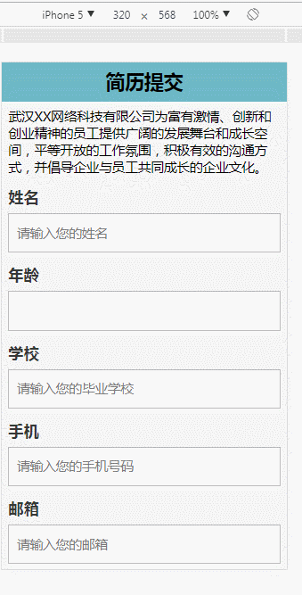

# HTML手机微信端数据提交表单页面设计submitHtml
效果如下：

fdfdfdsfd
all code:
```
<!Doctype html>
<html lang="en">
<head>
    <meta charset="UTF-8">
	<meta name="viewport" content="width=device-width, initial-scale=1.0, user-scalable=0, minimum-scale=1.0, maximum-scale=1.0">
	<meta name="apple-mobile-web-app-capable" content="yes">
	<meta name="apple-mobile-web-app-status-bar-style" content="black">
	<meta name="format-detection" content="telephone=no">
	<title>微官网自适应手机wap触屏版微信简历提交问卷调查网站模板下载</title>
	<link rel="stylesheet" href="css/form.min.css"/>
	<style>
		#bottom_info {
			position: relative;
			top: -3.8em;
			margin: 0 0.5em;
			padding: .8em 0;
			text-align: center;
			background-color: #18c178;
			color: #ffffff;
			border: medium hidden;
			border-radius: 0.1em;
			box-sizing: border-box;
			display: none;
		}
		#bottom_info a {
			/*
            color: #adadad;
            */
			width: 100%;
			text-decoration: none;
			outline: none;
		}
		#bottom_jump {
			position: relative;
			top: -3em;
			margin: 0 0.5em;
			padding: .8em 0;
			text-align: center;
			background-color: #62A9E3;
			color: #ffffff;
			border: medium hidden;
			border-radius: 0.1em;
			box-sizing: border-box;
			display: none;
		}
	</style>
</head>
<body>
<div id="subjects">
	<form id="main_form" action="#" method="get" onSubmit="try{uploadData();}finally{return false;}" accept-charset="utf-8" style="padding-bottom: 4em;">
		<div class="form_ctrl page_head" id="1" title="简历提交">
			<h2>简历提交</h2>
		</div>
		<div class="form_ctrl page_text" id="2" title="">
			<p>武汉XX网络科技有限公司为富有激情、创新和创业精神的员工提供广阔的发展舞台和成长空间，平等开放的工作氛围，积极有效的沟通方式，并倡导企业与员工共同成长的企业文化。</p>
		</div>

		<div class="form_ctrl input_text" id="3" title="姓名">
			<label class="ctrl_title">姓名</label>
			<input type="text" name="input_text" value="" placeholder="请输入您的姓名">
		</div>

		<div class="form_ctrl input_text" id="5" title="年龄">
			<label class="ctrl_title">年龄</label>
			<input type="text" name="input_text" value="" placeholder="">
		</div>

		<div class="form_ctrl input_text" id="4" title="学校">
			<label class="ctrl_title">学校</label>
			<input type="text" name="input_text" value="" placeholder="请输入您的毕业学校">
		</div>

		<div class="form_ctrl input_text" id="7" title="手机">
			<label class="ctrl_title">手机</label>
			<input type="text" name="input_text" value="" placeholder="请输入您的手机号码">
		</div>

		<div class="form_ctrl input_text" id="8" title="邮箱">
			<label class="ctrl_title">邮箱</label>
			<input type="text" name="input_text" value="" placeholder="请输入您的邮箱">
		</div>

		<div class="form_ctrl form_select" id="9" title="性别">
			<label class="ctrl_title">性别</label>
			<select name="select" num="1">
				<option value="2" selected="">男</option>
				<option value="1">女</option>
			</select>
		</div>

		<div class="form_ctrl input_text" id="6" title="专业">
			<label class="ctrl_title">专业</label>
			<input type="text" name="input_text" value="" placeholder="请输入您的专业">
		</div>

		<div class="form_ctrl form_radio" id="10" title="学历">
			<label class="ctrl_title">学历</label>
			<div id="form_radio_options" num="1" class="">
				<p>
					<input type="radio" name="10-radio" id="10-4" placeholder="radio">
					<label for="10-4">高中</label>
					<em class="progress_bar">
						<em class="pb_con">
							<em class="pb_thumb" style="width: 1.92%;background-color:green;"></em>
						</em>
						<em class="pb_perc" style="color:green">1.92%</em>
						<em class="pb_count">(1)</em></em>
				</p>

				<p>
					<input type="radio" name="10-radio" checked="" id="10-3" placeholder="radio">
					<label for="10-3">专科</label>
					<em class="progress_bar">
						<em class="pb_con">
							<em class="pb_thumb" style="width: 75%;background-color:red;"></em>
						</em>
						<em class="pb_perc" style="color:red">75%</em>
						<em class="pb_count">(39)</em>
					</em>
				</p>

				<p>
					<input type="radio" name="10-radio" id="10-2" placeholder="radio">
					<label for="10-2">本科</label>
					<em class="progress_bar">
						<em class="pb_con">
							<em class="pb_thumb" style="width: 13.46%;background-color:blue;"></em>
						</em>
						<em class="pb_perc" style="color:blue">13.46%</em>
						<em class="pb_count">(7)</em>
					</em>
				</p>

				<p>
					<input type="radio" name="10-radio" id="10-1" placeholder="radio">
					<label for="10-1">研究生</label>
					<em class="progress_bar">
						<em class="pb_con">
							<em class="pb_thumb" style="width: 9.62%;background-color:#2793D3;"></em>
						</em>
						<em class="pb_perc" style="color:#2793D3">9.62%</em>
						<em class="pb_count">(5)</em>
					</em>
				</p>
			</div>
		</div>

		<div class="form_ctrl form_select" id="11" title="应聘职位">
			<label class="ctrl_title">应聘职位</label>
			<select name="select" num="1">
				<option value="2">PHP开发工程师</option>
				<option value="3">HTML5开发工程师</option>
				<option value="4">DBA</option>
				<option value="1" selected="">软件测试工程师</option>
			</select>
		<!--	<div></div>-->
		</div>

		<div class="form_ctrl form_submit" id="12" title="点击下述按钮，提交简历。">
			<label class="ctrl_title">点击下述按钮，提交简历。</label>
			<input type="submit" name="submit" value="提交">
		</div>
	</form>

	<div id="bottom_info" style="display: block;">共
		<span id="collects">52</span>人填写</div>
	<div id="bottom_jump">点击查看</div>
	<div id="logo">
		<div style="margin-bottom: 5px;"></div>
	</div>

</body>
</html>


```

